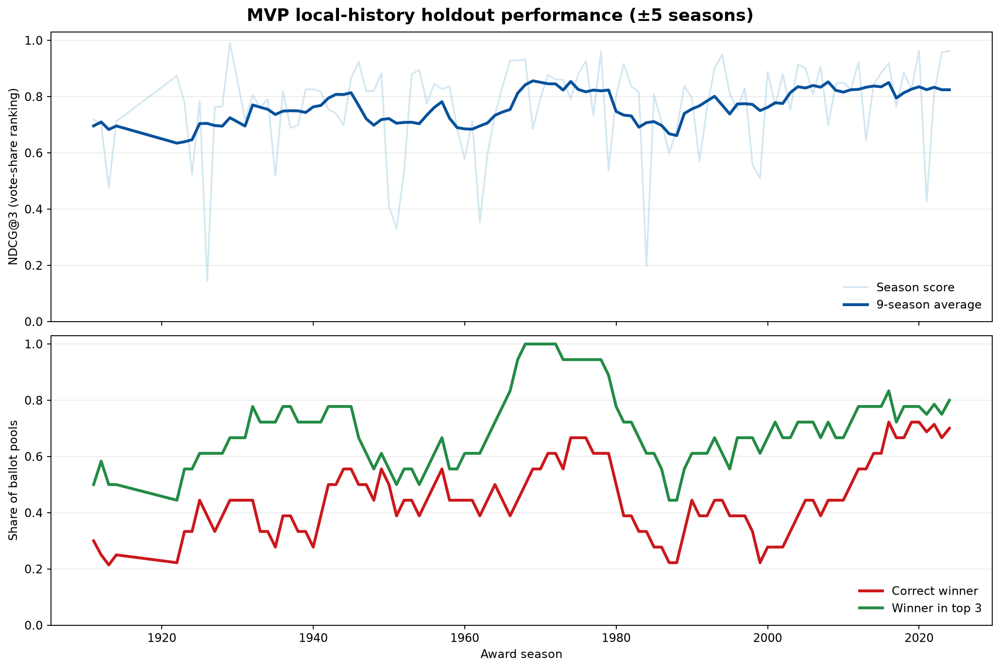
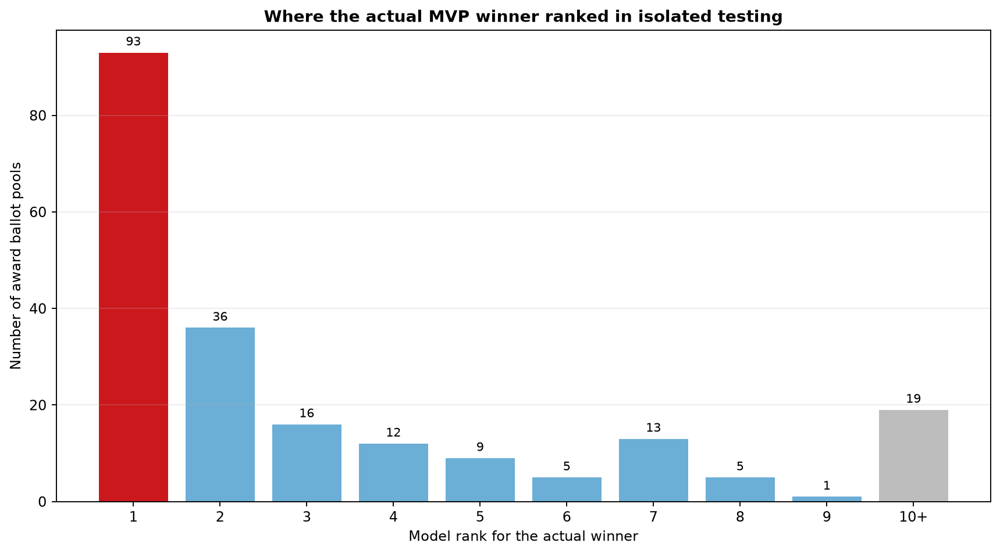
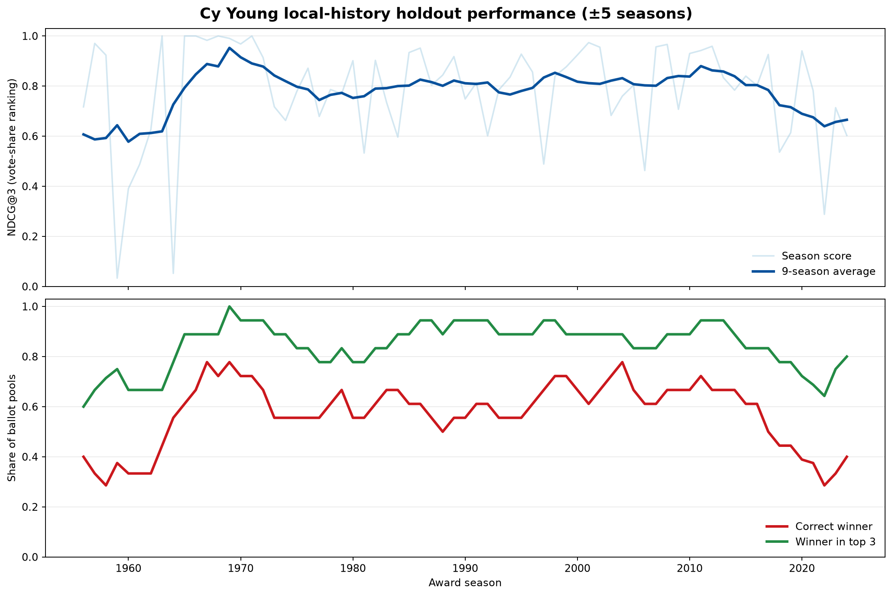
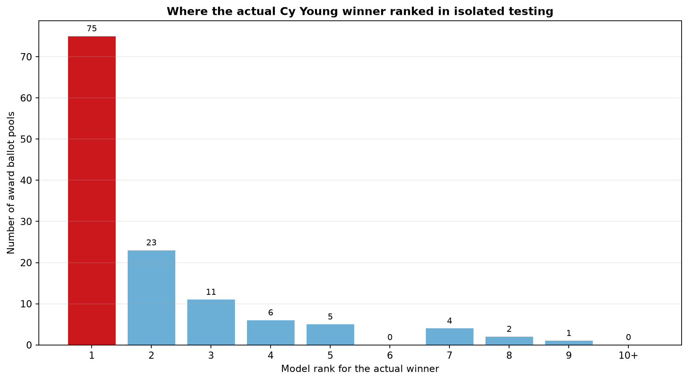

# Historical Award Predictor for OOTP
This is a prediction tool that uses real historical award voting histories to predict the Most Valuable Player Award, Cy Young Award and Rookie of The Year Award in Out of the Park Baseball for historical seasons.

# How To Use:

1. Open up the repo in VS code (or which ever IDE you prefer)
2. Run both trainmodel.py & train_cy_young.py.
3. Inside terminal run `streamlit run "YOUR FOLDER LOCATION"/app.py`.
4. Select the year you desire to make predictions for and train both models.
5. Upload the csv files exported from ootp (more info later).
6. Select which award you want to view.

# How To Prepare csv Files in OOTP
1. After a season is finished, navigate to the Sortable Statistics tab in the league statistics under Player Statistics.
2. Create a new view containing only the following stat columns: {ID, Name, Organization (Short), AB, R, 1B, 2B, 3B, HR, RBI, BB, HP, SO, SB, CS, W, L, SV, IP, ER, K, SHO, POS, Rookie}
3. Move to the Team Statistics tab and once again go to Sortable Statistics. Then, make another new view containing only the following stat columns: {Abbr, Sub-League, PCT}
4. Now that the views are created, export both the team and player statistics as a csv. They will be found in the import/export folder of your save.


# Features:
- Uses a pairwise prediction algorithm to generate mostly accurate rankings for players in the eyes of voters relative to the year they are in, for MVP, Cy Young and ROY Ballots
- Includes a season-isolated historical benchmark for MVP and Cy Young voting. It trains each test-season model only on nearby seasons, then measures how faithfully it recreates the held-out ballot.
- Allows filtering by position, which is useful for finding likely Silver Slugger winners
- Shows explanation behind each indivual player's scores
- Allows comparison of different players to see why one is ranked above another
- Note: the DH position is listed as OF in rankings, the individual OF positions also exist do not worry.


# Limitations:
- Fielding plays a role in real mvp races, but is unable to be integrated fully. The Lahman database does not have Total Zone Rating for most players, so if it were to be implemented only traditional fielding metrics could be used. However, OOTP does not seperate fielding statistics by each position a player played unless in the player viewing page. Exporting from each individual player would be inconvenient, so instead only the position of the player is taken. Since OOTP only uses the most recent defensive position played, sometimes the position can boost players rating for finishing the season as a shortstop or centerfielder even if they haven't played the full season there. It is for this reason as well I don't use any of the traditional fielding metrics either, since a player's fielding stats are combined between all their played positions, and the one chosen by the model assumes the player played there the whole time. So, the model approximates the player's defensive value by their position only (which is sometimes disingenuously assigned), which is not as accurate as an ideal model would be.
- Using the Cy Young model in years out of the range of the real life award (pre-1956) will rank it based on era-inaccurate results, as those years don't have any data. If you want to use this for MVPs pre 1911, you'd have the same issue.
- OOTP does not allow mvp voting history, and voter fatigue is still unmodeled. Early MVPs (Chalmers Award and the League Award) also barred previous winners. Training drops those ineligible prior winners from AL 1911-1928 and NL 1911-1929 so seasons like Ruth after 1923 are not treated as "great stats, zero share" losses. The winning season itself is kept. You may still want to exclude past winners by hand when simulating those years in OOTP.
- Retired players in OOTP do not list their team or league, so if you want to avoid this creating a 3rd category for retired/FA players, export the data at the conclusion of the regular season, before the offseason starts.

# Measuring Historical Voting Accuracy

Run the regular data-preparation scripts first, then run the evaluation:

```powershell
.\.venv\Scripts\python.exe evaluate_award_models.py
```

The benchmark uses a **season-isolated local-history holdout**. For every award season, it removes that entire season from training and fits a fresh ranking model using only the five seasons before it and the five seasons after it. This prevents a player from being evaluated on a ballot the model has already seen, while keeping the training era close enough to reflect contemporary voting preferences. Use `--window 10` to widen the local training neighborhood, or `--award mvp` / `--award cy` to run one award.

The generated files are saved in `graphs/model_evaluation/`:

- `summary.csv` and `summary.json` give the overall results.
- `*_season_results.csv` gives one result per historical season; `*_pool_results.csv` preserves individual league ballot pools.
- `*_seasonal_performance.png` charts top-of-ballot ordering over time. **NDCG@3** is 1.0 for a perfect ordering of the most-supported candidates; the lower chart tracks whether the actual winner was first or at least in the model's top three.
- `*_winner_rank_distribution.png` shows how far down the model's ranking the actual winner landed. This makes winner-miss severity visible instead of reducing it to a single accuracy number.

The test reports several complementary measures: NDCG@3 for vote-share ordering, Spearman correlation for full-ballot ordering, exact-winner accuracy, top-three winner recall, and reciprocal winner rank. These are retrospective measures of how closely the features reproduce historical voting behavior—not claims of future predictive accuracy for a particular OOTP save.

The checked-in run uses a five-season neighborhood on either side of every held-out ballot and excludes years before each award existed. Its headline results are:

- **MVP (106 seasons):** 0.764 mean NDCG@3; the winner was ranked first in 44.8% of ballot pools and inside the top three in 69.8%.
- **Cy Young (69 seasons):** 0.781 mean NDCG@3; the winner was ranked first in 58.0% of ballot pools and inside the top three in 84.8%.

That gap is useful diagnostic evidence: with the current feature set, the Cy Young model reproduces historical winner selection more reliably than the MVP model. MVP voting is more likely to reflect factors the training data does not fully capture, such as defensive value, narrative, and voter preference.

### MVP voting benchmark





### Cy Young voting benchmark





# Additional Info:
This was created with help from both ChatGPT and Gemini, so while I believe everything is working properly, there may be minor errors I did not catch. The data used for the model is from the Lahman Baseball Database, which can be accessed here https://sabr.org/lahman-database/. A version of this database is contained within this repo, and without it all this wouldn't be possible. I have tested this across 2 devices, and it worked on both of them, but the testing has not been extensive and has only been done on windows. You may need to download some python packages for it to work.
